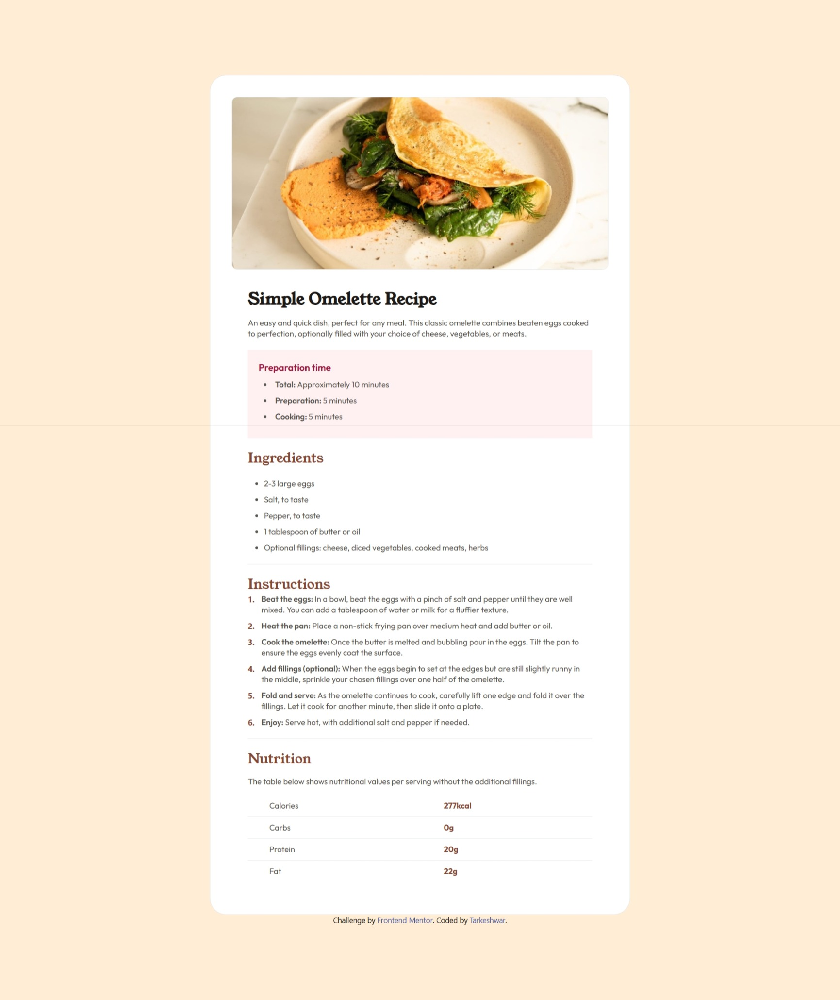

# Frontend Mentor - Recipe Page Solution

This is my solution to the Recipe Page challenge on Frontend Mentor. This project helped me practice responsive layouts, semantic HTML, and Tailwind CSS fundamentals.

## Overview

### The Challenge

Users should be able to:

* View the recipe page on different screen sizes
* Read recipe details clearly with proper typography
* Experience a responsive layout that adapts to mobile and desktop devices

### Screenshot



### Links

* Solution URL: https://www.frontendmentor.io/profile/tarkeshwaruranw
* Live Site URL: https://fm-recipe-page-tarkeshwar.netlify.app/
## My Process

### Built With

* HTML5
* Tailwind CSS
* Mobile-First Workflow
* Flexbox
* Responsive Design

### What I Learned

While building this project, I learned:

* How to use Tailwind CSS utility classes effectively
* Mobile-first responsive design principles
* Using Flexbox for layout alignment
* Working with spacing, typography, and colors in Tailwind
* Structuring content using semantic HTML elements

Example of responsive styling:

```html
<main class="w-full md:w-3/4 mx-auto bg-white rounded-3xl">
```

This helped me understand how Tailwind's responsive prefixes work and how layouts can adapt to different screen sizes.

### Continued Development

In future projects, I want to improve:

* Tailwind CSS proficiency
* Responsive design skills
* Accessibility best practices
* Component-based development with React

### Resources

* Frontend Mentor Challenge Documentation
* Tailwind CSS Documentation
* ChatGPT for debugging and understanding Tailwind concepts

### AI Collaboration

I used ChatGPT during this project to:

* Understand Tailwind CSS utility classes
* Debug layout and responsiveness issues
* Learn best practices for responsive design
* Get explanations for CSS and Tailwind concepts

The AI helped me learn the reasoning behind solutions instead of simply providing code.

## Author

* GitHub: https://github.com/tarkeshwaruranw
* Frontend Mentor: https://www.frontendmentor.io/profile/tarkeshwaruranw

## Acknowledgments

Thanks to Frontend Mentor for providing real-world frontend challenges that help developers improve their skills through hands-on practice.
